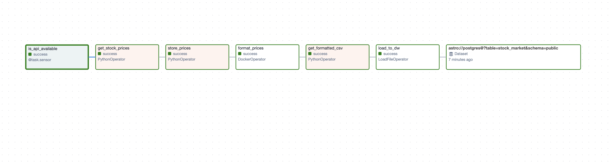

Overview
========
This is a dag which helps with orchestrating a simple ETL pipeline for the stock markets. Please find an overview of the following important steps below.

1. We check whether or not the api to fetch stock prices is available or not. We use a sensor for this purpose. Once this is done, we proceed to the next step.
2. We obtain the stock prices based on the `_get_stock_prices` function situated in the include/stock_market/tasks.py file.