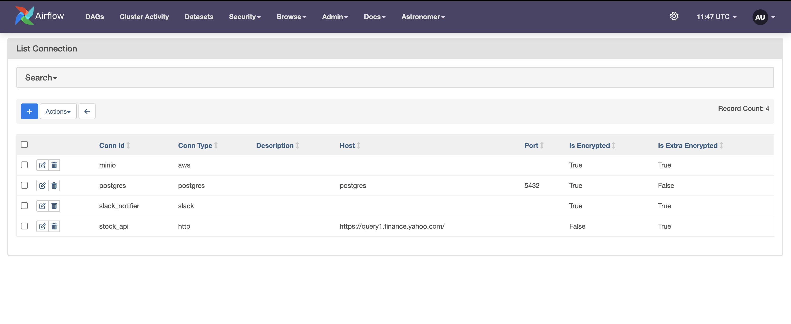

Overview
========
This is a dag which helps with orchestrating a simple ETL pipeline for the stock markets. Please find an overview of the following important steps below.

1. We check whether the api to fetch stock prices is available or not. We use a sensor for this purpose. Once this is done, we proceed to the next step.
2. We obtain the stock prices based on the `_get_stock_prices` function situated in the include/stock_market/tasks.py file. The connections details are stored in the matabase with the connection name `stock_api`.
3. The output of the previous task is obtained in the json format. This is stored in Minio using the `_store_prices` function in the CSV format.
4. We then run some transformation steps as defined by the python file `stock_transform.py` inside the spark folder. This runs on a spark cluster with a master node and 1 worker node.
5. The output of step 4 is obtained using the function `_get_formatted_csv` and this is loaded onto postgres as shown.
6. Lastly, we have a `on_success_callback` and `on_failure_callback` configured as SlackNotifiers.

Note
=====
All the connections are stored in the metabase. For this pipeline, we have these.

Steps to Run
================
To run this pipeline, one needs to have docker installed locally and execute the following commands.

1. brew install astro
2. astro dev init
3. astro dev start

This will create all the containers as specified in the `docker-compose.override.yml` file and install all the dependencies as specified in the `requirements.txt` file in the docker environment.
The username and password required to log into airflow are `admin` and `admin` respectively.